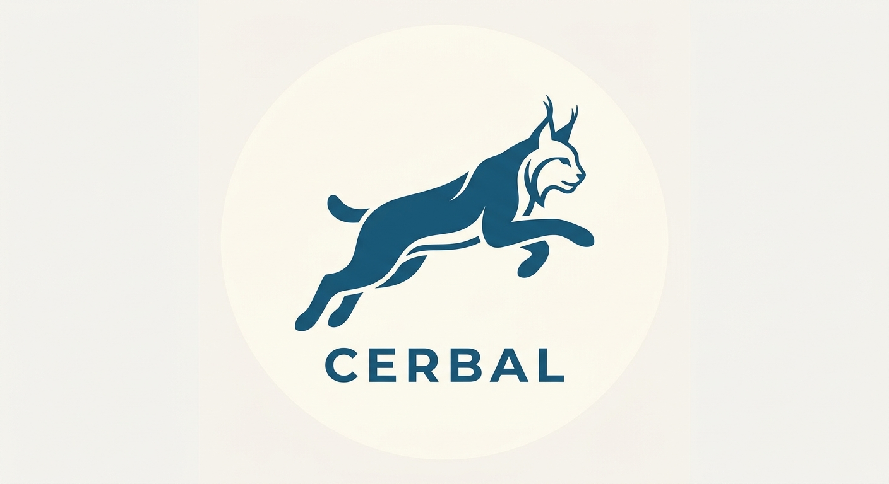

---
## Cerbal

*A lightweight interpreted language and bytecode VM written in Rust, designed to explore custom language design and execution.*

> base statement

*define variables*

```
def var = 123;
var

```

*If statement*

```
if 52 == 52 {
    1.0
} else {
    0.0
}

if 5 != 2 {
    1.0
} else {
    0.0
}
```

*Supported also >, <, >=, <=*

*Arephmetic also*

```
2 + 2
5 / 2
3 * 3
5 * (5 + 5) / 2
```